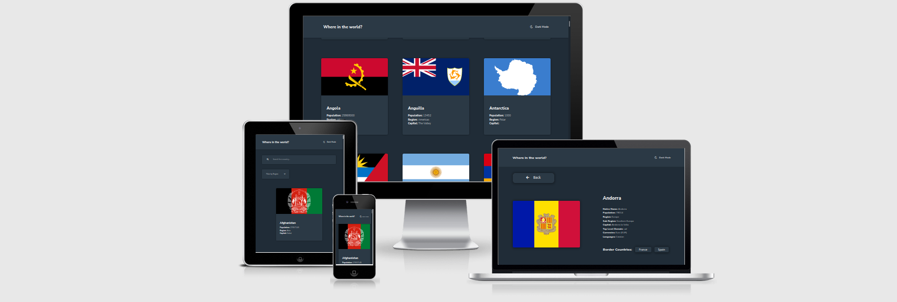
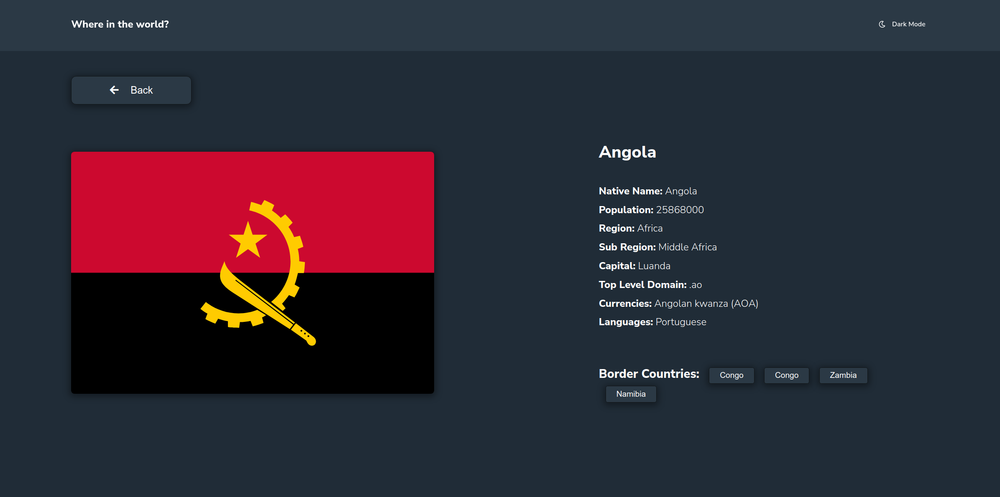
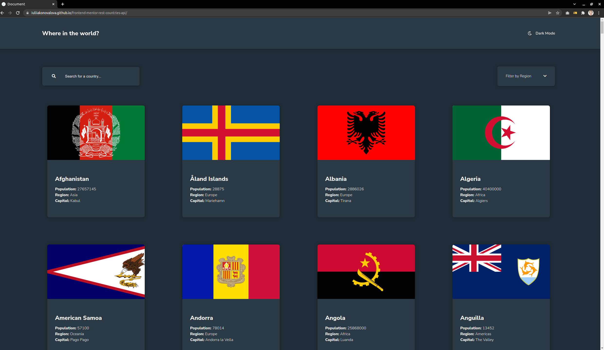
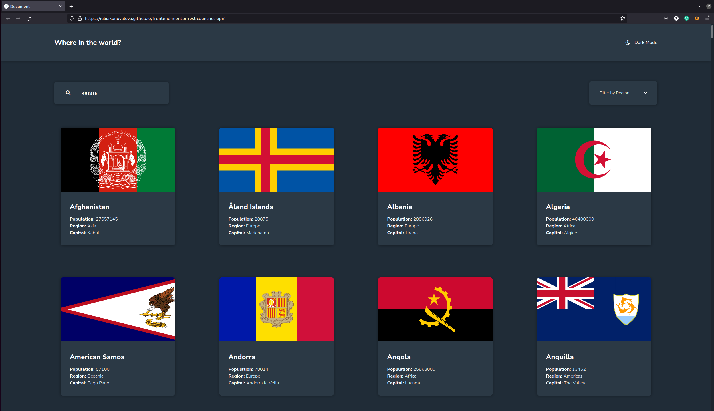
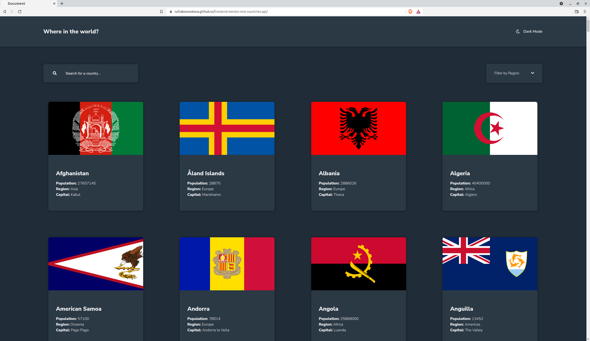

# Frontend Mentor - Time tracking dashboard

The project was based on the challenge provided by [Frontend Mentor](https://www.frontendmentor.io).

This is a solution to the [Time tracking dashboard challenge on Frontend Mentor](https://www.frontendmentor.io/challenges/rest-countries-api-with-color-theme-switcher-5cacc469fec04111f7b848ca). 

## The design provided

## Table of contents

- [User Stories](#user-stories)
- [Features](#features)
- [Technologies Used](#technologies-used)
- [Design](#design)
- [Bugs](#bugs)
- [Testing](#testing)
  - [Compatibility](#compatibility)
  - [Validator testing](#validator-testing)
  - [Lighthouse Report](#lighthouse-report)
- [Deployment](#deployment)
- [Author](#author)
- [Credits](#credits)
- [Acknowledgments](#acknowledgments)

I was using design files provided for this challenge in order to make the result look as similar as possible to the provided images.

I have also added various breakpoints in order to provide the best user experience.

The solution to this challenge can be accessed by this [link](https://iuliiakonovalova.github.io/frontend-mentor-rest-countries-api/)

---
## User Stories

### First Time Visitor Goals:

* As a First Time Visitor, I want to easily understand the main purpose of the website, so I can learn more about this website.
* As a First Time Visitor, I want to be able to easily navigate through the website, so I can find the content.
* As a First Time Visitor, I want to find the website useful.

### Frequent Visitor Goals:
* As a Frequent User, I want to get countries information, so I can learn about countries'.
* As a Frequent User, I want to have a chance click on the neighboring countries, so I can learn about neighboring countries.
* As a Frequent User, I want to have a chance so select and search countries, so I can easily find a country needed.

---

## Features

## Features

+ ### Main Page

    - Represent: 

        * the time tracking dashboard.

    - Consist:

        

        * Navbar with the incentive, and mode control to pick the theme.
        
        * Search panel to search for a country.

        * Select dropdown menu to select countries by continent

        * summary about each country with its flag.

        * When clicking a country card, the user can learn more about this country, click on boarder countries to be redirected to another country, or go back to the main page.
        
        

---

## Technologies Used

- [HTML](https://developer.mozilla.org/en-US/docs/Web/HTML) - was used as the foundation of the site.
- [CSS](https://developer.mozilla.org/en-US/docs/Web/css) - was used to add the styles and layout of the site.
- [CSS Flexbox](https://developer.mozilla.org/en-US/docs/Learn/CSS/CSS_layout/Flexbox) - was used to arrange items symmetrically on the pages.
- [CSS Grid](https://developer.mozilla.org/en-US/docs/Web/CSS/grid) - was used to make "gallery" and "contact" pages responsive.
- [CSS roots](https://developer.mozilla.org/en-US/docs/Web/CSS/:root) - was used to declaring global CSS variables and apply them throughout the project. 
- [VSCode](https://code.visualstudio.com/) - was used as the main tool to write and edit code.
- [Git](https://git-scm.com/) - was used for the version control of the website.
- [GitHub](https://github.com/) - was used to host the code of the website.
- [GIMP](https://www.gimp.org/) - was used to make and resize images for the README file.
- [JS](https://www.javascript.com/) - was used to display content on the page.
- [async functions](https://developer.mozilla.org/en-US/docs/Web/JavaScript/Reference/Statements/async_function) - were used to fetch the data from the local json file.

---
## Design

- The design, color scheme and font-family were provided by [Frontend Mentor](https://www.frontendmentor.io).

- Family: [Nunito Sans](https://fonts.google.com/specimen/Nunito+Sans) (Weights: 300, 600, 800).

---

## Bugs
+ **Solved bugs**

1. The previous version of the REST COUNTRIES API was not available and the recent one has overwhelming data. Since I was aware of the issues with this data base happening before, I made a decision to use local JSON file + svg images from free source: [Flagpedia.net](https://flagpedia.net/) to keep my code running regardless of the availability of rest countries API.

+ **Unsolved bugs**

    - The size of the flags were changed due to the requirements to keep cards with the same size. But in order to make flags more realistic, there is a solution:

    Change width of the .data__card to max-width

---

## Testing
### Compatibility:

+ The app was tested on the following browsers: Chrome, Firefox, Brave, Edge:

  - Chrome:

  
  
  - Firefox:

  

  - Brave:

  